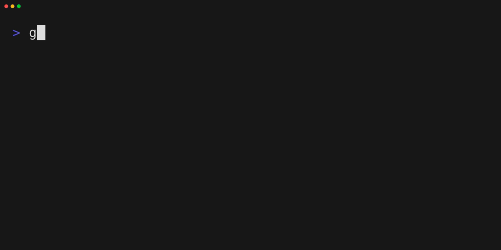

# 🚀 goup

Simple version manager like `rustup` or `nvm` but for Go.



## Features

With goup, you can easily install, update and switch between versions of the Go SDK within a single, self-contained binary. Currently, goup is only supported on Linux and macOS, but [support for Windows is planned](https://github.com/zekroTJA/goup/issues/2).

## Installation

Simply download the latest binaries from the [Releases Page](https://github.com/zekrotja/goup/releases). Alternatively, you can also install goup using cargo.

```bash
cargo install --git https://github.com/zekrotja/goup
```

After that, run the following command to setup your environment to use goup to handle your Go versions.
```bash
goup env -p
source ~/.profile
```

This will add the required environment variables and `$PATH` extension to your `.profile` file.

Alternatively, if you just want to fiddle around with the tool, you can also just apply the environment to your current terminal session.

```bash
eval "$(goup env)"
```

## How does it work?

goup uses the [Go Repository on GitHub](https://github.com/golang/go) to query available versions using the `git ls-remote --tags` command *([it is planned](https://github.com/zekroTJA/goup/issues/1) to add a fallback which uses the GitHub API when `git` is not available on the current system)*. This version list is then used to download selected versions from the official download server *(https://go.dev/dl/)*. The downloaded SDKs are then directly un-zipped and un-packed while being downloaded into goup's worksapce directory, which is in the current users home directory at `$HOME/.local/goup`. All downloaded SDK versions are then stored in `$HOME/.local/goup/installations`. When selecting a specific installation version, the location in the installation directory is sym-linked to `$HOME/.local/goup/current` and the selected version is stored in the file `$HOME/.local/goup/.current_version`.

Using the command `goup env -p`, this will set the path of `$HOME/.local/goup/current/go` as your `GOROOT` environment variable and will add `$HOME/.local/goup/current/go/bin` to the beginning of your `$PATH`. This way, goup does not touch your local installation of Go and you cann roll back to before simply by removing the goup entries in your `.profile` and deleting the `$HOME/.local/goup` directory.

## Credits

This tool is very much inspired by the both wonderful tools [Schnitz' fnm](https://github.com/Schniz/fnm) and [Rust's rustup](https://github.com/rust-lang/rustup).

---

© 2023 Ringo Hoffmann.  
Covered by the [MIT License](LICENSE).
